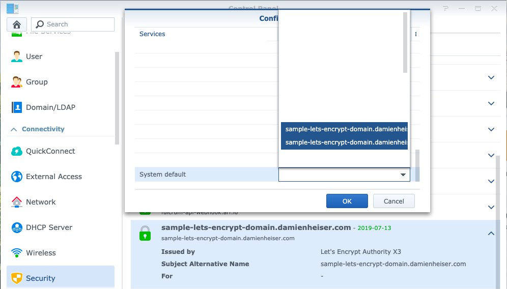

# SynologyDSMTools
Various scripts and tools I use for administration of Synology DSM systems
## updateSynologyCertificateStore.py
Acme.sh is great and all for getting those certificates and installing them into the proper places for DSM to use.  But DSM doesn't recognize those new certificates. :(

Call this during the reload command of acme.sh to add the certificates to be available within DSM. Example is in issueNewCertificate.bash

Enjoy

## issueNewCertificate.bash
Simple reusable bash script that asks for the domain in a prompt, then calls Acme.sh and updateSynologyCertificateStore.py

### To Use
- chmod +x issueNewCertificate.bash
- ./issueNewCertificate.bash

### Expected Output 
```./issueNewCertificate.bash 
Synology Acme.sh Lets Encrypt! Certificate Generator!
Please enter domain name.
sample-lets-encrypt-domain.damienheiser.com
[Sun Apr 14 08:59:24 PDT 2019] Creating domain key
[Sun Apr 14 08:59:24 PDT 2019] The domain key is here: /usr/local/share/acme.sh/sample-lets-encrypt-domain.damienheiser.com/sample-lets-encrypt-domain.damienheiser.com.key
[Sun Apr 14 08:59:24 PDT 2019] Single domain='sample-lets-encrypt-domain.damienheiser.com'
[Sun Apr 14 08:59:24 PDT 2019] Getting domain auth token for each domain
[Sun Apr 14 08:59:24 PDT 2019] Getting webroot for domain='sample-lets-encrypt-domain.damienheiser.com'
[Sun Apr 14 08:59:24 PDT 2019] Getting new-authz for domain='sample-lets-encrypt-domain.damienheiser.com'
[Sun Apr 14 08:59:25 PDT 2019] The new-authz request is ok.
[Sun Apr 14 08:59:25 PDT 2019] Found domain api file: /usr/local/share/acme.sh/dnsapi/dns_namecom.sh
[Sun Apr 14 08:59:26 PDT 2019] Successfully logged in.
[Sun Apr 14 08:59:26 PDT 2019] Successfully added TXT record, ready for validation.
[Sun Apr 14 08:59:26 PDT 2019] Sleep 120 seconds for the txt records to take effect
[Sun Apr 14 09:01:28 PDT 2019] Verifying:sample-lets-encrypt-domain.damienheiser.com
[Sun Apr 14 09:01:31 PDT 2019] Success
[Sun Apr 14 09:01:31 PDT 2019] Removing DNS records.
[Sun Apr 14 09:01:31 PDT 2019] Successfully logged in.
[Sun Apr 14 09:01:32 PDT 2019] Successfully retrieved the record id for ACME challenge.
[Sun Apr 14 09:01:32 PDT 2019] Successfully removed the TXT record.
[Sun Apr 14 09:01:32 PDT 2019] Verify finished, start to sign.
[Sun Apr 14 09:01:34 PDT 2019] Cert success.
-----BEGIN CERTIFICATE-----
-----REDACTED CERTIFICATE-----
-----END CERTIFICATE-----
[Sun Apr 14 09:01:34 PDT 2019] Your cert is in  /usr/local/share/acme.sh/sample-lets-encrypt-domain.damienheiser.com/sample-lets-encrypt-domain.damienheiser.com.cer 
[Sun Apr 14 09:01:34 PDT 2019] Your cert key is in  /usr/local/share/acme.sh/sample-lets-encrypt-domain.damienheiser.com/sample-lets-encrypt-domain.damienheiser.com.key 
[Sun Apr 14 09:01:34 PDT 2019] The intermediate CA cert is in  /usr/local/share/acme.sh/sample-lets-encrypt-domain.damienheiser.com/ca.cer 
[Sun Apr 14 09:01:34 PDT 2019] And the full chain certs is there:  /usr/local/share/acme.sh/sample-lets-encrypt-domain.damienheiser.com/fullchain.cer 
[Sun Apr 14 09:01:35 PDT 2019] Installing cert to:/usr/syno/etc/certificate/_archive/TPcXK1/cert.pem
[Sun Apr 14 09:01:35 PDT 2019] Installing CA to:/usr/syno/etc/certificate/_archive/TPcXK1/chain.pem
[Sun Apr 14 09:01:35 PDT 2019] Installing key to:/usr/syno/etc/certificate/_archive/TPcXK1/privkey.pem
[Sun Apr 14 09:01:35 PDT 2019] Installing full chain to:/usr/syno/etc/certificate/_archive/TPcXK1/fullchain.pem
[Sun Apr 14 09:01:35 PDT 2019] Run reload cmd: /bin/python /root/updateSynologyCertificateStore.py -d TPcXK1 -u sample-lets-encrypt-domain.damienheiser.com
nginx reloaded.
[Sun Apr 14 09:01:35 PDT 2019] Reload success
```

### Certificate in DSM

